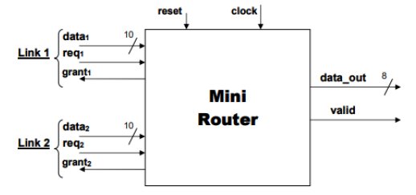

## Minirouter
The Mini Router is a synchronous component which have two input links, a link is composed by three elements:
1. data: Which contains the data to propagate in the 8 MSB and the priority in the remaining 2 bits  
2. req: When this variable is equal to ‘1’ the value inside ‘data’ is valid  
3. grant: Required to notify to the sender of the data that the propagation has been completed. Setting it to ‘1’ for one clock cycle result in completing the handshake  

  

The Mini Router’s goal is to propagate the data received on its link: propagate ‘data1’ to ‘data_out’ if ‘req1’ is set or ‘data2’ if ‘req2’ is set.  
According to the specifications, if the req1 and req2 are both set, the choice will be to choose the link to propagate by a priority principle provided by the last two bits of the 'data' channel. Those two bits can assume four different values: ‘00’, ‘01’, ‘10’, ’11’ and each one represents a level of priority that goes from 0 (min. priority) to 3 (max priority).

# Project Insight
In this project I've realized a possible implementation of the minirouter using **VHSIC Hardware Description Language** (VHDL) and I've analysed such implementation using Modelsim to verify code and its behaviour.
The implementation is then analysed using the RTL analysis of Vivado.